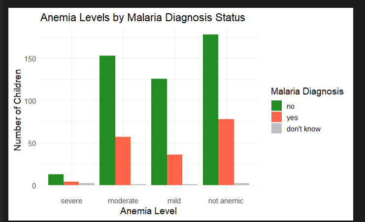

# Malaria_analysis
**Data Source**
The dataset was obtained from the Kenya Data Portal in DTA (Stata) format. Initially, I faced challenges reading this format in R, but learned to use the haven package to properly import and work with the data.

```
# Install required package if needed
install.packages("haven")

# Load the package
library(haven)

# Read the Stata (.dta) file
children_record <- read_dta("path/to/your/file/KEKR81FL.DTA")

# View the first few rows
head(children_record)
```
# During this analysis
I familiarized myself with standard malaria indicators and coding conventions used in global health datasets. 
Below are some key terms and their representations in the data: 
ml13e: Binary indicator for whether a child was tested for malaria
- 0 = No
- 1 = Yes

s406: "Told child had malaria" (diagnosis result)
- 0 = No
- 1 = Yes
- 2 = Don’t know

# Simplified Data Workflow
Imported data using haven::read_dta()
Reduced columns to only malaria-relevant variables
Converted coded values to readable factors
Performed analysis on this simplified dataset

# visualizations
### **Key Visualizations & Insights**  

1. **Anemia Distribution**  
   - *What it shows*: A bar chart revealing that **46% of children were not anemic**, while **27% had moderate anemia** (strongly linked to malaria).  
   - *Why it matters*: Confirms known medical correlations between malaria and anemia severity.
  
     

2. **Malaria vs. Anemia**  
   - *What it shows*: Grouped bars comparing malaria diagnosis across anemia levels. **Moderately anemic children had the highest malaria rates**.  
   - *Takeaway*: Reinforces malaria’s role in causing anemia, especially in endemic areas.
  
     
    
3. **Bed Net Usage**  
   - *What it shows*: Malaria rates in children **rural** or **urban** residence, suggesting:  
     -  Most children that have malaria are from the rural areas as compared to the children in urban
   
     

4. **Drug Prevalence**  
   - *What it shows*: **AL (Artemether-Lumefantrine)** was the top-used antimalarial, aligning with WHO guidelines.
       
---

### **Visualization Strengths**  
- **Clear labeling**: Anemia levels and drug names are intuitive.  
- **Actionable contrasts**: Compared malaria rates across key variables (anemia, nets, residence).  
- **Color choices**: Used red/orange for malaria/severe anemia for quick interpretation.  
 

*(All plots made with `ggplot2` in R.)*  


